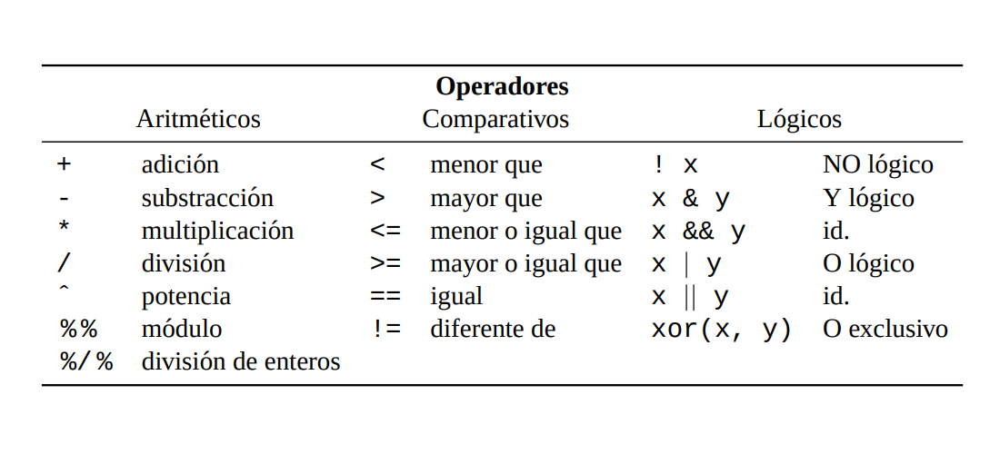

```{r setup, include=FALSE}

library(xaringanthemer)
style_mono_light(base_color ="#383C69")
#2c5697") # color institucional puj  
#"#23395b") # color verde militar

```

class: center
.pull-left[ 
# IV - Encuentro 
# Colombiano de 
# Educación Estadística </p>

]
.pull-right[
# Introducción a R 
### con apliaciones a la enseñanza 
### de la Estadística 

**Daniel Enrique González Gómez**

*******
</br>


]
---
### Quienes somos


---
# Agenda

### Dia 1 : Introducción a 

### Dia 2 :  apoyo a la enseñanza de la Estadística

### Dia 3 : apoyo a las labores de docencia e investigación

---
## Contexto
```{r echo = FALSE}
# remotes::install_github("gadenbuie/xaringanExtra")
xaringanExtra::use_panelset()
```
.panelset[
  .panel[.panel-name[Comunicación]
  ### La forma de comunicarnos cambia de manera acelerada
  
  ]
  
  .panel[.panel-name[Aprendizaje]
  ### Aprendemos haciendo
   
     
     ]
    
.panel[.panel-name[Tecnología]
### Las herramientas tecnológicas son una ayuda, no un propósito


  ]
.panel[.panel-name[Ayer-Hoy]
 ###  

### Liz Reisberg 
**“La nueva dinámica del aula: la Enseñanza y el Aprendizaje para los millennials”** (jun/2018)

+ No podemos criar a nuestros hijos, como nos criaron a nosotros...
+ Hay que hacer la pregunta clave... 

    ]  
.panel[.panel-name[Enseñanza]
### Una metodología de enseñanza-aprendizaje definida y clara


* https://medium.com/@gabriela.solera05/el-aula-invertida-en-ingl%C3%A9s-flipped-classroom-es-una-modalidad-de-blended-learning-aprendizaje-86170628d95b  

]  
.panel[.panel-name[Met.Estadistica]
<html>
<div class="container-wrapper-genially" style="position: relative; min-height: 400px; max-width: 100%;"><video class="loader-genially" autoplay="autoplay" loop="loop" playsinline="playsInline" muted="muted" style="position: absolute;top: 45%;left: 50%;transform: translate(-50%, -50%);width: 80px;height: 80px;margin-bottom: 10%"><source src="https://static.genial.ly/resources/panel-loader-low.mp4" type="video/mp4" />Your browser does not support the video tag.</video><div id="5f1ba8da1829700da368b4ab" class="genially-embed" style="margin: 0px auto; position: relative; height: auto; width: 100%;"></div></div><script>(function (d) { var js, id = "genially-embed-js", ref = d.getElementsByTagName("script")[0]; if (d.getElementById(id)) { return; } js = d.createElement("script"); js.id = id; js.async = true; js.src = "https://view.genial.ly/static/embed/embed.js"; ref.parentNode.insertBefore(js, ref); }(document));</script>
</html>
] 
.panel[.panel-name[PyE]
<html>
<div class="container-wrapper-genially" style="position: relative; min-height: 400px; max-width: 100%;"><video class="loader-genially" autoplay="autoplay" loop="loop" playsinline="playsInline" muted="muted" style="position: absolute;top: 45%;left: 50%;transform: translate(-50%, -50%);width: 80px;height: 80px;margin-bottom: 10%"><source src="https://static.genial.ly/resources/panel-loader-low.mp4" type="video/mp4" />Your browser does not support the video tag.</video><div id="5f2ae96b94d21c0d831cdb4c" class="genially-embed" style="margin: 0px auto; position: relative; height: auto; width: 100%;"></div></div><script>(function (d) { var js, id = "genially-embed-js", ref = d.getElementsByTagName("script")[0]; if (d.getElementById(id)) { return; } js = d.createElement("script"); js.id = id; js.async = true; js.src = "https://view.genial.ly/static/embed/embed.js"; ref.parentNode.insertBefore(js, ref); }(document));</script>
</html>
  ]  
]
---
## **Que es R** 

.pull-left[ 
+ Es un lenguaje para la computación  estadística

   + Licencia (GNU GPL)  abierta y gratis
   
   + Creciente popularidad en ciencia de datos

   + Multipalataforma (UNIX, Windows, MacOS)

   + Ross Ihaka y Robert Gentieman (U.Auckland - Nueva Zelanda) 1993

   + Lenguaje multiparadigma
   
   + Codigo construido en C y Fortran
   
   + Gran comunidad muy activa 
   
   + Mas de 7000 paquetes 

https://www.r-project.org/
]
.pull-right[

]

---
## Lenguajes utilizados en ciencia de datos 


.footnote[[*] Tomada de: https://mappinggis.com/2019/07/lenguajes-de-programacion-para-realizar-ciencia-de-datos/]

---
## R y RStudio


---
## R online
.pull-left[ 

https://rdrr.io/snippets/
]

.pull-right[

https://www.mycompiler.io/online-r-compiler


]
---
## RStudio

</br>
1.Fuente/  2.Consola/  3.Ambiente/  4.Archivos/ 5.Graficos/ 6.Paquetes/ 7.Ayudas

---
## Instalación R y RStudio

.pull-left[ 


https://www.r-project.org/
]

.pull-right[


https://www.rstudio.com/products/rstudio/download/
]

**Descargar e instalar R y RStudio**

https://www.youtube.com/watch?v=Nmu4WPdJBRo

---
## Ayuda

```{r tidy=FALSE, eval=FALSE}
?pie  # abre la ventana de ayudas
```

```{r tidy=FALSE, eval=FALSE}
example(pie) # muestra ejemplos de la funcion
```

```{r tidy=FALSE, eval=FALSE}
help.start()
```

 
---

### RStudio  cheatsheets


.footnote[[*] https://www.rstudio.com/resources/cheatsheets/]


---
## Tipos de datos

.pull-left[ 
+ **Vectores** : arreglo unidimensional

```{r tidy=FALSE, eval=TRUE}
x=c(1,2,3,4,5)         #<<
```

+ **Matrices**  : arreglo bidimensional
```{r tidy=FALSE}
x=1:9
m=matrix(x,nrow=3)   #<<
```
]

.pull-right[

+ **Arrays**  : arreglos multimensionales 
```{r tidy=FALSE}
x=1:9
y=10:19
mn=array(c(x,y),dim=c(3,3,2)) #<<
```

+ **Factores**  : vector de variables categóricas 
```{r tidy=FALSE, eval=TRUE}
x=letters[1:3]
y=rep(x, times=3)
z=rep(x, each = 3)
```

]
---
## Tipos de datos

+ **Listas** : colección de objetos cada uno de tipos diferentes
```{r tidy=FALSE, eval=FALSE}
h=hist(rnorm(100)) #<<
```

+ **Data Frames** : estructura de datos de dos dimensiones - filas y columnas - base de datos
```{r tidy=FALSE, eval=FALSE}
data=data(iris) #<<
```

+ **Funciones**
```{r tidy=FALSE, eval=FALSE}
fx=function(x){1/(x-1)^2} #<<
fx(100)
```

---
## Resumen


.footnote[[*] Tomado de  R para principiantes]
---

## Operadores 



.footnote[[*] Tomado de  R para principiantes]
---
# Actividad 

**Instalación de R y RStudio** : 
+ [\href{https://www.r-project.org/](R CRAN) 

+ [https://rstudio.com/products/rstudio/download/](RStudio).

---
## Créditos
 
+ Imagenes
    + https://pixabay.com/es/images/
    + https://medium.com/@gabriela.solera05/el-aula-invertida-en-ingl%C3%A9s-flipped-classroom-es-una-modalidad-de-blended-learning-aprendizaje-86170628d95b

+ R para principiantes, J.A. Ahumada (2003)
+ The Book R, T.M. Davies (2016)
+ R para profesionales de los datos, C.J. Gil Vellosta (2018) 
+ Beginning Data Science with R , M. A. Pathak (2014)
+ R for Data Science - H.Wickham - G. Grolemund (2016)
---
class: inverse, center, middle

# Práctica 

https://github.com/dgonzalez80/ACEdEstad2021/blob/main/codigoR/codigo1.R