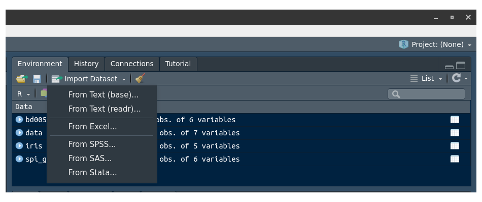
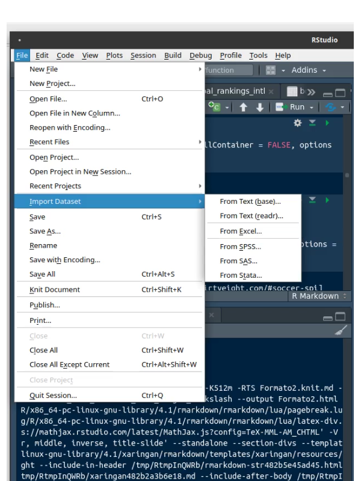

```{r setup, include=FALSE}
options(htmltools.dir.version = FALSE)
knitr::opts_chunk$set(
  fig.width=9, fig.height=3.5, fig.retina=3,
  out.width = "100%",
  cache = FALSE,
  echo = TRUE,
  message = FALSE, 
  warning = FALSE,
  fig.show = TRUE,
  hiline = TRUE
)

options(htmltools.dir.version = TRUE)
xaringanExtra::use_panelset()
library(RColorBrewer)
library(readxl)
library(DT)
```

# Base de datos

Una base de datos es un conjunto de datos pertenecientes a un mismo contexto y almacenados sistemáticamente para su posterior uso.
<br/>
Wikipedia

Una base de datos en estadística es un conjunto de información relacionada con una población organizada en filas y columnas. Las columnas corresponden a las variables y las filas están relacionadas con los individuos u objetos de estudio.


Existen repositorio de bases de datos para uso general

+ dataset en RStudio

+ [Portal Bases de datos abiertos Colombia](https://www.datos.gov.co/)

+ [Datos Banco mundial](https://datos.bancomundial.org/)

+ [Portal de Datos Abiertos de Esri España](https://opendata.esri.es/)


.footnote[[*] Open Data Barometer : https://opendatabarometer.org/4thedition/report/?lang=es]
---
# Leer datos
.pull-left[ 
+ Data set R  : bases de datos al interior de los paquetes de R
+ Utilizando menu de RStudio, datos en DD en formato:
    + Excel
    + csv
    + SPSS
    + SAS
    + Stata

+ Utilizando funciones en linea de consula
+ De forma automatica con paquete RSocrata


]
.pull-right[



]


---
### R Dataset 

```{r}
paquetes=library(help = "datasets")
head(paquetes$info[[2]])
tail(paquetes$info[[2]])
```

https://stat.ethz.ch/R-manual/R-devel/library/datasets/html/00Index.html

.footnote
---
### R Dataset 

```{r tidy=FALSE, eval=FALSE}
data(iris) # dataset de R
```


```{r ,warning=FALSE, message=FALSE}
head(iris) # visualiza las primeras 6 filas de la base
```
Datos de iris (de Fisher o Anderson) 
+ longitud y ancho del sépalo 
+ largo y ancho de pétalos
+ especies: setosa,  versicolor y virginica.

**Base de datos estadísticos** : arreglo de filas y columnas (matriz) donde por lo general las columnas representan las variables y las filas los registros de los objetos de estudio

---
#### Base de datos estudianes Probabilidad y Estadistica 

```{r, warning=FALSE, message=FALSE}
library(readxl)
bd0052 <- read_excel("data/bd0052.xlsx", col_types = c("numeric", "numeric", "text", "text",
                                                       "numeric", "text", "numeric"))
DT::datatable(head(bd0052,81),fillContainer = FALSE, options = list(pageLength = 6))
```

---

```{r }
library(readr)
data=read_csv("data/spi_global_rankings_intl.csv")
DT::datatable(head(data,218),fillContainer = FALSE, options = list(pageLength = 6))
```

.footnote[[*]https://data.fivethirtyeight.com/#soccer-spi]
---
## Importar datos de manera automatica

La API de datos abiertos de Socrata le permite acceder mediante programación a una gran cantidad de recursos de datos abiertos de gobiernos, organizaciones sin fines de lucro y ONG de todo el mundo. Haga clic en el enlace de abajo y pruebe un ejemplo en vivo ahora mismo.

https://dev.socrata.com/

Cargar la base de datos de COVID-19 Colombia

```{r tidy=FALSE, eval=FALSE}
# install.packages("RSocrata")  # instal paquete RSocrata
 library(RSocrata)
 token ="ew2rEMuESuzWPqMkyPfOSGJgE"
 Colombia= read.socrata("https://www.datos.gov.co/resource/gt2j-8ykr.json", app_token = token)
 saveRDS(Colombia,"Colombia.RDS")
```

https://www.datos.gov.co/
https://dev.socrata.com/foundry/www.datos.gov.co/gt2j-8ykr

.footnote[[*] Se requiere solicitar token en la página de los datos - 
 RDS formato de R para almacenar cualquier objeto - se lee con readRDS ]

---
# Etapas del proceso de datos


.footnote[[*] Imagen tomada de : https://bitsandbricks.github.io/ciencia_de_datos_gente_sociable/]
---
## Ordenar los datos

Es importante después de haber importado la base de datos, hacer una revisión de cada una de las variables con el fin de poder detectar:

+ Datos faltantes (NA)

+ Datos anómalos o raros


+ Etiquetas mal colocadas ( minúsculas, MAYÚSCULAS, Titulo...)
```{r tidy=FALSE, eval=FALSE}
> table(Colombia$ubicacion)

        casa         Casa         CASA    Fallecido     Hospital Hospital UCI          N/A 
       11012      3121567            7        85207        14568         4284        12788 
```

```{r tidy=FALSE, eval=FALSE}

      f       F       m       M 
      3 1688878       2 1560550 
```

---

## Arreglo de la base de datos

```{r tidy=FALSE, eval=FALSE}
library(stringr)
Colombia$sexo=str_to_lower(Colombia$sexo)
Colombia$estado[Colombia$estado=="N/A"]="NA"
Colombia$estado=str_to_lower(Colombia$estado)

Colombia$recuperado[Colombia$recuperado=="N/A"]="NA"
Colombia$recuperado=str_to_lower(Colombia$recuperado)

Colombia$fuente_tipo_contagio[Colombia$fuente_tipo_contagio=="N/A"]="NA"
Colombia$fuente_tipo_contagio=str_to_lower(Colombia$fuente_tipo_contagio)

Colombia$ubicacion[Colombia$ubicacion=="N/A"]="NA"
Colombia$ubicacion=str_to_lower(Colombia$ubicacion)
```
---
class: inverse
background-image: url("img/tablero1.jpg")
<br/><br/><br/><br/><br/><br/><br/><br/><br/><br/><br/><br/><br/><br/><br/>
## Indicadores
---
## Tablas de frecuencia
```{r, warning=FALSE}
table(bd0052$carrera) 
```

```{r, warning=FALSE}
data.frame(table(bd0052$carrera)) 
```

---

```{r, message=FALSE}
t1=summarytools::freq(bd0052$carrera, cumul = FALSE, headings = FALSE)
t1
```
---

```{r,  echo=TRUE, message=FALSE, warning=FALSE}
library(agricolae)
h2=with(bd0052,graph.freq(promacum,plot=FALSE))
t2=table.freq(h2)
colnames(t2) = c("  LI  ", "  LS  ", "marca clase", "Frec.Abs","Frec.Rel", "Frec.Abs.Ac","Frec.Rel.Ac")
t2
```

---
.pull-left[
```{r, message=FALSE, warning=FALSE}
summarytools::descr(mtcars$mpg)
```
]
.pull-right[
```{r, message=FALSE, warning=FALSE}
summarytools::descr(bd0052$promacum)
```
]
---
class: inverse, center, middle
# Visualización 
---
## Gráficos variables cualitativas con R base
```{r echo = FALSE}
# remotes::install_github("gadenbuie/xaringanExtra")
xaringanExtra::use_panelset()
```
.panelset[
.panel[.panel-name[Gráfico de tortas]

```{r, fig.height=4}
cc=c(20, 10, 20, 20, 20, 20, 20, 20, 20, 30, 20, 20, 20, 10, 30, 20, 20, 30, 20, 30, 30, 20, 10, 30, 20, 20, 30, 30, 10, 20, 10, 20, 20, 20, 10, 20, 10, 20, 20, 30, 30, 30, 10, 30, 20, 20, 20, 20, 20, 20, 10, 20, 30, 30, 10, 10, 10, 20, 10, 20, 10, 30, 20, 10, 20, 30, 10, 30, 30, 30, 20, 30, 30, 30, 30, 30, 30, 20, 10, 30, 10, 20, 20, 10, 20, 20, 20, 20, 10, 20); labs=c("Ing. Industrial","Administración ","Contaduría "); pct=round(table(cc)/sum(table(cc))*100); labs=paste(labs, pct);labs=paste(labs, "%", sep = " ") 
pie(table(cc), labels=labs, main=" Distribución por carrera")
```
]
.panel[.panel-name[Diagrama de barras]
```{r, fig.height=3.5}
ev=table(rbinom(90,5,0.80)); 
barplot(ev, col=c("red","yellow","orange","green","blue"), main = "Evaluación proceso de inducción")
```
]
  
.panel[.panel-name[Diag. de barras dos variables]
```{r, fig.height=3.5}
counts= table(mtcars$vs, mtcars$gear); rownames(counts)=c("Montor en linea", "Motor en V")
barplot(counts, main="Número de cambios adelante por Tipo de motor",  xlab="Número de cambios adelante ",col=c("dodgerblue3","orange"),
  legend = rownames(counts))
```
]  
]
---
### Gráficas variables cuantitativas con R base
```{r echo = FALSE}
# remotes::install_github("gadenbuie/xaringanExtra")
xaringanExtra::use_panelset()
```

.panelset[
.panel[.panel-name[Diag.de arbol]
```{r}
nf=c(4.1, 2.7, 3.1, 3.2, 3.0, 3.2, 2.0, 2.4, 1.6, 3.2, 3.1, 2.6, 2.0, 2.4, 2.8, 3.3, 4.0, 3.4, 3.0, 3.1, 2.7, 2.7, 3.0, 3.8, 3.2, 2.2, 3.5, 3.5, 3.8, 3.5, 3.9, 4.2, 4.3, 3.9, 3.2, 3.5, 3.5, 3.7, 4.1, 3.7, 3.5, 3.6, 3.2, 3.1, 3.4, 3.0, 3.0, 3.0, 2.7, 1.7, 3.6, 2.1, 2.4, 3.0, 3.1, 2.5, 2.5, 3.6, 2.2, 2.4, 3.1, 3.3, 2.7, 3.7, 3.0, 2.7, 3.0, 3.2, 3.1, 2.4, 3.0, 2.7, 2.5, 3.0, 3.0, 3.0, 3.2, 3.1, 3.8, 4.1, 3.7, 3.5, 3.0, 3.7, 3.7, 4.1, 3.7, 3.9, 3.7, 2.0)
stem(nf)
```
]
  .panel[.panel-name[Histograma]
```{r, fig.height=3.5}
h1=hist(nf, main = "Nota final matemáticas fundamentales", xlab = "nota", ylab="frecuencias absolutas", labels=TRUE, col="dodgerblue3", ylim = c(0,30))
abline(v=3,col="red")
```
  ]

.panel[.panel-name[Diag.de Densidad]
```{r, fig.height=3.5}
nf=c(4.1, 2.7, 3.1, 3.2, 3.0, 3.2, 2.0, 2.4, 1.6, 3.2, 3.1, 2.6, 2.0, 2.4, 2.8, 3.3, 4.0, 3.4, 3.0, 3.1, 2.7, 2.7, 3.0, 3.8, 3.2, 2.2, 3.5, 3.5, 3.8, 3.5, 3.9, 4.2, 4.3, 3.9, 3.2, 3.5, 3.5, 3.7, 4.1, 3.7, 3.5, 3.6, 3.2, 3.1, 3.4, 3.0, 3.0, 3.0, 2.7, 1.7, 3.6, 2.1, 2.4, 3.0, 3.1, 2.5, 2.5, 3.6, 2.2, 2.4, 3.1, 3.3, 2.7, 3.7, 3.0, 2.7, 3.0, 3.2, 3.1, 2.4, 3.0, 2.7, 2.5, 3.0, 3.0, 3.0, 3.2, 3.1, 3.8, 4.1, 3.7, 3.5, 3.0, 3.7, 3.7, 4.1, 3.7, 3.9, 3.7, 2.0)
plot(density(nf), main="Distribución de las notas de matematias fundamentales", col="dodgerblue3")
```
  ]
  
.panel[.panel-name[Diag.de Cajas]
```{r, fig.height=3.5}
nf=c(4.1, 2.7, 3.1, 3.2, 3.0, 3.2, 2.0, 2.4, 1.6, 3.2, 3.1, 2.6, 2.0, 2.4, 2.8, 3.3, 4.0, 3.4, 3.0, 3.1, 2.7, 2.7, 3.0, 3.8, 3.2, 2.2, 3.5, 3.5, 3.8, 3.5, 3.9, 4.2, 4.3, 3.9, 3.2, 3.5, 3.5, 3.7, 4.1, 3.7, 3.5, 3.6, 3.2, 3.1, 3.4, 3.0, 3.0, 3.0, 2.7, 1.7, 3.6, 2.1, 2.4, 3.0, 3.1, 2.5, 2.5, 3.6, 2.2, 2.4, 3.1, 3.3, 2.7, 3.7, 3.0, 2.7, 3.0, 3.2, 3.1, 2.4, 3.0, 2.7, 2.5, 3.0, 3.0, 3.0, 3.2, 3.1, 3.8, 4.1, 3.7, 3.5, 3.0, 3.7, 3.7, 4.1, 3.7, 3.9, 3.7, 2.0)
boxplot(nf, main="Nota final matemáticas fundamentales",col="dodgerblue3")
abline(h=3, col="red")
```
  ]  
  
.panel[.panel-name[Diag.de cajas~factor]
```{r, fig.height=3.5}
nf=c(4.1, 2.7, 3.1, 3.2, 3.0, 3.2, 2.0, 2.4, 1.6, 3.2, 3.1, 2.6, 2.0, 2.4, 2.8, 3.3, 4.0, 3.4, 3.0, 3.1, 2.7, 2.7, 3.0, 3.8, 3.2, 2.2, 3.5, 3.5, 3.8, 3.5, 3.9, 4.2, 4.3, 3.9, 3.2, 3.5, 3.5, 3.7, 4.1, 3.7, 3.5, 3.6, 3.2, 3.1, 3.4, 3.0, 3.0, 3.0, 2.7, 1.7, 3.6, 2.1, 2.4, 3.0, 3.1, 2.5, 2.5, 3.6, 2.2, 2.4, 3.1, 3.3, 2.7, 3.7, 3.0, 2.7, 3.0, 3.2, 3.1, 2.4, 3.0, 2.7, 2.5, 3.0, 3.0, 3.0, 3.2, 3.1, 3.8, 4.1, 3.7, 3.5, 3.0, 3.7, 3.7, 4.1, 3.7, 3.9, 3.7, 2.0)
cc=c(20, 10, 20, 20, 20, 20, 20, 20, 20, 30, 20, 20, 20, 10, 30, 20, 20, 30, 20, 30, 30, 20, 10, 30, 20, 20, 30, 30, 10, 20, 10, 20, 20, 20, 10, 20, 10, 20, 20, 30, 30, 30, 10, 30, 20, 20, 20, 20, 20, 20, 10, 20, 30, 30, 10, 10, 10, 20, 10, 20, 10, 30, 20, 10, 20, 30, 10, 30, 30, 30, 20, 30, 30, 30, 30, 30, 30, 20, 10, 30, 10, 20, 20, 10, 20, 20, 20, 20, 10, 20)
labs=c("Ing. Industrial","Administración ","Contaduría ")
boxplot((nf~cc),main="Nota final matemáticas fundamentales por carrera", col="dodgerblue3"); abline(h=3, col="red"); abline(h=4, col="blue")
```
  ]  
.panel[.panel-name[Diag.de Dispersión]
```{r, fig.height=3.5}
ed=round(rnorm(90,18,1),1)
plot(ed,nf, main="Edad vs Nota final matemáticas fundamentales", ylim = c(0,5), xlab = "Edad", ylab = "Nota final",col="dodgerblue3",pch=19)
grid()
```
  ]  
  
.panel[.panel-name[Series de tiempo]
```{r, fig.height=3.5}
plot(AirPassengers, main="Numero de pasajeros por mes", col="dodgerblue3", lwd = 2)
```
  ]
.panel[.panel-name[Resumen]

```{r, eval=FALSE}
x=rnorm(100,100,20)
y=rnorm(100,100,25)
z=rbinom(100,4,0.30)
t=1:100
par(mfrow=c(1, 5))
pie(table(z))
barplot(table(z))
stem(x)
hist(x)
boxplot(x)
plot(x,y)
plot(t,y, type="l")
plot(density(x))
```

]  
]
---
## ggplot2


```{r, message=FALSE, warning=FALSE, fig.height=2}
library(ggplot2)
ggplot(bd0052, aes(x=promacum, y=grupo)) +
  geom_boxplot(fill="#313ae8",              # color de relleno
               color="#bf6f2e",             # color de lineas
               alpha=0.5)+
  geom_point(color="#b431e8",alpha=0.9) 
```
---
## highcharter


https://jkunst.com/highcharter/

https://rstudio-pubs-static.s3.amazonaws.com/320413_6ab300527e8548b1a3cbd0d4c6200fcc.html

---
## plotly


https://plotly.com/r/

https://plotly-r.com/
---
## Shiny


+ [Genoma humano](https://shiny.rstudio.com/gallery/genome-browser.html)

+ [Paquetes de R](https://gallery.shinyapps.io/087-crandash/)

+ [Galeria](https://shiny.rstudio.com/gallery/)

---
class: inverse, center, middle

# Práctica 

https://github.com/dgonzalez80/ACEdEstad2021/blob/main/codigoR/codigo2.R


