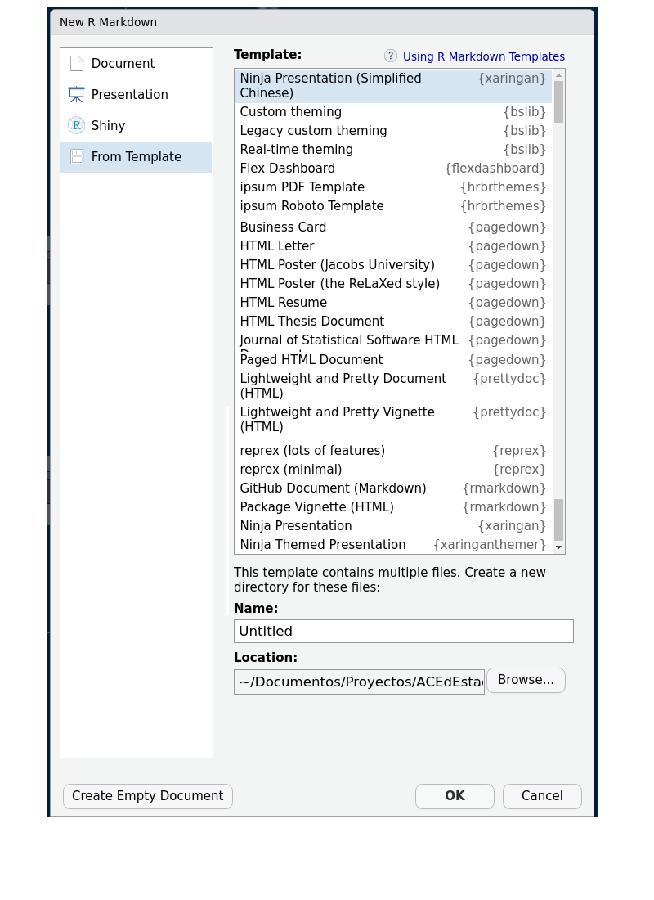

## Herramientas de trabajo
 

---
### Es posible hacer todo junto
 + Hacer la parte escrita
 + Realizar los procesos de computo - cuadros - graficos - resultados
 + 
 + Actualizarlos documentos con un clik
 + Replicar los informes
 
 
---
 
 
.footnote[[*] Tomado de: https://ulyngs.github.io/rmarkdown-workshop-2019/slides/Day1.html#1 ]
---
.pull-left[ 
# 

### Que es 

]

.pull-right[

### Que podemos hacer 

]

---

# Trabajaremos 

### * Informes

### * Presentaciones

### * Tableros

### * Libros

---

---

---
## Cuadernos

.footnote[[*] Tomado de: https://rmarkdown.rstudio.com/lesson-10.html]

---
## Tableros

.footnote[[*] Tomado de: https://beta.rstudioconnect.com/jjallaire/htmlwidgets-highcharter/htmlwidgets-highcharter.html]

---
## Presentaciones

---
## Libros - notas de clase

.footnote[[*] https://bookdown.org/yihui/bookdown/]

---
Markdown Cheat Sheet
https://www.markdownguide.org/cheat-sheet/

Guia RMarkdown
https://markdown-guide.readthedocs.io/en/latest/

R Markdown Cookbook
Yihui Xie, Christophe Dervieux, Emily Riederer (2020)
https://bookdown.org/yihui/rmarkdown-cookbook/

R Markdown: The Definitive Guide
Yihui Xie, J. J. Allaire, Garrett Grolemund (2021)
https://bookdown.org/yihui/rmarkdown/

bookdown: Authoring Books and Technical Documents with R Markdown
Yihui Xie (2021)
https://bookdown.org/yihui/bookdown/

flexdashboard
https://pkgs.rstudio.com/flexdashboard/index.html
https://www.paulamoraga.com/book-geospatial/sec-dashboardswithshiny.html
https://www.paulamoraga.com/book-geospatial/sec-flexdashboard.html

articulos
https://bookdown.org/yihui/rmarkdown/rticles-templates.html

presentaciones
https://rmarkdown.rstudio.com/lesson-11.html
https://bookdown.org/yihui/rmarkdown/powerpoint-presentation.html # power point
https://bookdown.org/yihui/rmarkdown/xaringan-preview.html # xaringan
http://arm.rbind.io/slides/xaringan.html#1   # xaringan
https://www.kirenz.com/slides/xaringan-demo-slides.html#6

galeria 
https://rmarkdown.rstudio.com/gallery.html

Creación de páginas web con R Markdown
https://www.youtube.com/watch?v=JxsreeFsu8g

---
class: inverse, center, middle

# Daniel Enrique González Gómez 
### dgonzalez@javerianacali.edu.co
### dgonzalez80@ gmail.com
### https://github.com/dgonzalez80

